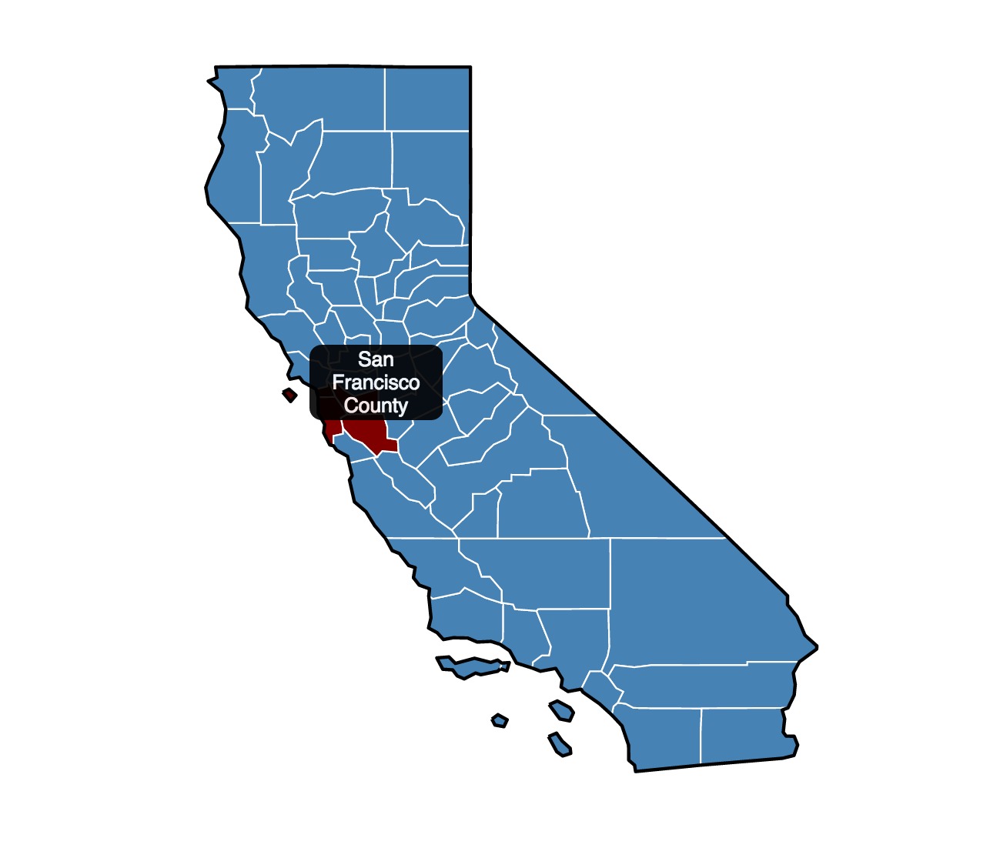

##California Counties in TopoJSON
Open sourcing this mostly because I couldn't find a good simple TopoJSON file of California counties suitable for mapping with D3.

`caCountiesTopoSimple.json` is your best bet. It's smaller and its lines are smoother than `ca-counties-topo.json` which is the same data before simplification.

Here's how the map looks with a Mercator projection and some styling and a tooltip. [Live version here](http://scottpham.github.io/california-counties/).

##How It's Made
I made this using Census TIGER files and converted to geoJSON with ogr2ogr. Then converted to TopoJSON with Mike Bostock's topojson command line tool.

[Bostock shows how it's done](http://bost.ocks.org/mike/map/).

Also included in the topojson is some random stuff that the census included which I decided to leave in.  `areaLand` and `areaWater` properties should give the respective land and water areas in square meters (if I'm reading [this](http://quickfacts.census.gov/qfd/meta/long_LND110210.htm) correctly). 

With so few subunits in this file, it doesn't really add to the filesize.

##Projection
I found a nice ["projected" TopoJSON]() from Bostock's examples, which means you can set the projection to `null`. 

But I wanted to get a pure TopoJSON for future-proofing purposes.  I couldn't actually figure out the Albers projection without using AlbersUSA and transforming to find California (seemed like a copout!) so I just used Mercator:

    var svg = d3.select("#map").append("svg")
	    .attr("width", width)
	    .attr("height", height);
